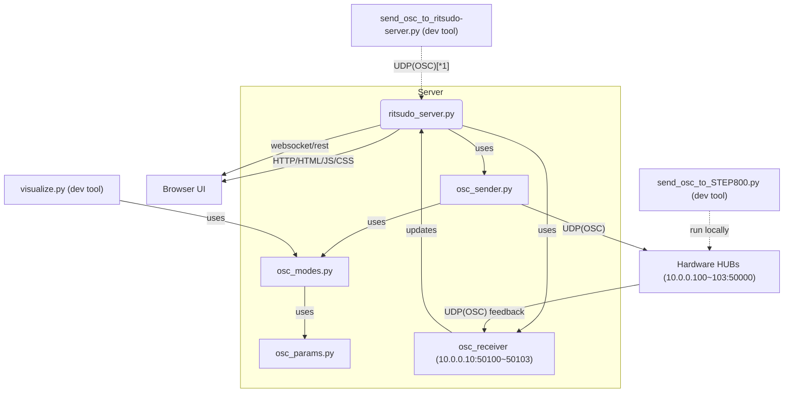

# kfy25

Welcome to the `kfy25` project!
英文の箇所はcopilotが書いているので嘘が混じることがあります。参考程度に。

## Overview

kfy25 is a web-based OSC servo controller built with Flask and python-osc. It provides a browser UI to control multiple servos, tune parameters in real time, and receive feedback from devices.

This README has been updated to reflect recent changes in the repository (Oct 2025): a parallel OSC listener helper in `sendosc.py`, a per-template FontAwesome toggle for offline use, and an added `STROKE_OFFSET` UI control.

## Requirements

- Python 3.8+
- pip packages:
  - flask
  - python-osc
  - numpy
  - flask_socketio

Install:

```powershell
pip install flask python-osc numpy flask_socketio
```

## Run (WebUI)

Start server (development / local):

```powershell
python osc_webUI\ritsudo_server.py
```

Open in browser:

```text
http://localhost:5000/
```

Notes: the main server entry is `osc_webUI/ritsudo_server.py` (replaces older `send_osc_webUI.py`). By default the app is configured to avoid running duplicate OSC receiver threads from the Flask reloader; use the file above to start the server directly.

## Global Params

| Parameter        | Description                                                                 |
| ---------------- | --------------------------------------------------------------------------- |
| `MODE`           | Current mode ID. Determines the active behavior of the system.              |
| `HOST`           | IP address of the host machine.                                             |
| `PORT`           | Port number for OSC communication.                                          |
| `HOSTS`          | List of client IP addresses for OSC communication.                          |
| `OSC_RECV_PORTS` | List of ports for receiving OSC messages.                                   |
| `NUM_SERVOS`     | Number of servo motors in the system.                                       |
| `RATE_fps`       | Frame rate for the system's operation.                                      |
| `ALPHA`          | Smoothing factor for certain calculations.                                  |
| `Kp`, `Ki`, `Kd` | PID controller parameters for proportional, integral, and derivative gains. |
| `STROKE_OFFSET`  | Offset value for the stroke position. 動作の中立点を決める。                |
| `SEND_CLIENTS`   | Boolean flag to enable or disable sending data to STEP800.                  |
| `SEND_CLIENT_GH` | Boolean flag to enable or disable sending data to Grasshopper.              |

---

## [>>>モードのリスト<<<](modes.md)

## 実装メモ

### モーターのマッピング(2025.10.21)

内部的な`motorID`は、`1`から`NUM_SERVOS=31`までの値をとり、これを`get_motor_client_and_local_id()`で各基板に割り当てます

計算された螺旋下から順の動作量`vals`の値をどの物理モータ(すなわち`motorID`)に割り当てるかは、`osc_params.py`内にハードコードする`MOTOR_POSITION_MAPPING`を使って変更できます。`MOTOR_POSITION_MAPPING`は`send_all_setTargetPositionList()`での送信の際のみに使われるローカル配列`mapped_vals`にのみ適用され、他のあらゆる操作は物理的な(=STEP800の)モータのIDを基準に動作します。
なお、全軸ホーミング動作は`MOTOR_POSITION_MAPPING`の順で螺旋順に下から動作します。

### 全軸ホーミング(2025.10.21)

POST`/home_all:5000`もしくはOSC`/Home[]:10000`で呼び出される全軸ホーミング動作`home_all()`では、応答がなかった(=STEP800からの戻り値が`3`にならなかった)軸はHardHiZになります。

要するにホーミングに失敗した軸はそのままブラブラさせておくということです。

### パラメータ固定(2025.10.21)->(2025.10.23)

`osc_params.py`内の`LOCKED_KEYS = ["STROKE_OFFSET"]`で指定されているパラメータは変更リクエストが握りつぶされます

- `ritsudo-server.py`内でのsocket更新ルーチンは`LOCKED_KEYS`を見ていて、該当する場合は更新を送りません
- `main.js`内`setFormEnabled()`では別途`disabled`が設定されています
- これらの値を変えたい時は、`ritsudo-server.py`プロセスを止め、`params.json`を編集してください
  
～～～

- **`STROKE_LENGTH`のロックは解除されました**
- **変更できないパラメータはwebUIのスライダーがdisableされるようになりました**
- webUIのスライダー範囲を超える値が(OSC等で)設定された場合は値が赤くハイライトされるようになりました

### 速度上限(2025.10.23)

絶対速度の上限`LIMIT_SPEED`がかかるようになりました

### 振幅設定値上限(2025.10.23)

`STROKE_OFFSET`の最大値`50000`がハードコードされました

- 上限を超えた値をOSCやwebUIから設定すること自体は可能で、動作計算時に上限値に丸められます
  - `params.json`を手で編集した時に誤記する可能性があるため、終段で制限しています
- グローバルパラメータ`STROKE_LENGTH_LIMIT`で上書きできます
- モード固有パラメータ`STROKE_LENGTH_LIMIT_SPECIFIC`でさらに上書きできます

### 同じModeの連続使用(2025.10.23)

OSCで`"MODE"`パラメータを含むメッセージを送信した際は、以前のモードに関わらず冒頭から再生されるようになりました

### OSC_Speaker(2025.10.23)

ローカルホスト`10000`への`/GetAverageSpeed[]` `/GetSpeed[]` `/GetPosition[]`に対して、ローカルホスト`10001`に`/AverageSpeed[(int)speed]` `/Speed[(int)Speed[NUM_SERVOS]]` `/Position[(int)Position[NUM_SERVOS]]`が返るようになりました

## トラブルシューティング

### 実機が動かない

- ターゲットに`boards`にチェックが入っていますか？
- `Init`した際にSTEP800の赤LEDは点灯しますか？
  - STEP800の電源を再投入する
  - ターミナルでSTEP800にpingを打ってみる

### Grasshopperが動かない

- ターゲット`gh`にチェックが入っていますか？

### 動かない

- `Start`していますか？
- `STROKE_LENGTH`が`0`ではありませんか？
- `BASE_FREQ`や`U_AVERAGE`が`0`ではありませんか？

## File Structure

```text
osc_webUI/
├── modes.md
├── osc_listener.py
├── osc_modes.py
├── osc_params.py
├── osc_receiver.py
├── osc_sender.py
├── ritsudo_server.py        # main server entry
├── visualize.py
├── static/
│   ├── main.js
│   └── style.css
├── templates/
│   └── index.html
```

## System structure

The following diagram shows the logical components and their interactions (OSC send/receive flows):



## Notes

- Parameter changes are saved to `params.json` automatically.
- The UI is designed for modern browsers. Set `USE_FA=false` in the template for offline environments.

## [*1] Player->Server OSC messages

基本的に、WebUIの項目名のパラメータはいずれもそのまま送ることができます
送信先は現状以下の通りです

``` json
HOST = "127.0.0.1"//ローカルホスト
PORT_SEND = 10000
```

### グローバルパラメータ

- `/STROKE_OFFSET [(int) stroke_offset >=0]`
  - メカニカルな原点から、動作の中立点までの距離です
  - 単位はL6470内のステップ距離です
  - 典型値は`50000`です

- `/LIMIT_ABSOLUTE [(int) limit_absolute]`
  - メカニカルな原点から、伸長側の動作限界までの距離=絶対限界値です
  - 単位はL6470内のステップ距離です
  - 当然`stroke_offset`より大きい必要があります
  - 典型値は`120000`です

- `/LIMIT_RELATIONAL [(int) limit_relational]`
  - 両隣の伸び具合から計算される、ベルトが伸びきるまでの距離=相対限界値です
    - 内部的には抽象化された先端同士の距離を余弦定理と一元二次方程式で評価しています
  - 単位はL6470内のステップ距離です
  - 当然`stroke_offset`より大きい必要があります
  - 典型値は`173205`です

- `/ALPHA [(float) alpha >0]`
  - ステッピングモータ(サーボ)指示値にかけるローパスフィルタのαです
  - `1.0`でLPFなし、`0.0`に近いほどフィルタ強いです
  - 典型値は`0.3`です

### モード固有パラメータ

- `/MODE [(int) mode]`  
  - モード番号(`101:Simple Sine`のとき、`101`)を送ります
  - 他のモード固有パラメータとあわせてbundle送信するのが推奨です

- `/EASING_DURATION [(float) easing_time >=0]`
  - モード切替直後のイージング時間をsecで指定

- `/BASE_FREQ [(float) base_freq >=0]`
  - 動作の速さの基準値をHzで指定

- `/U_AVERAGE [(float) dudt]`
  - 実時刻`t`に対する可変時刻`u`の進みの速さの倍率の、平均値を指定
  - `u`は設定によらず非負です
  
- `/U_WIDTH [(float) u_width >=0]`
  - 実時刻`t`に対する可変時刻`u`の進みの速さの倍率の、ランダム幅(全幅*1/2)を指定します
  - `0`にすると`U_AVERAGE`での設定で固定されます
  - ランダムは`U_AVERAGE - U_WIDTH ~ U_AVERAGE + U_WIDTH`の間で単純に分布します
  - `u`の変化率(=`dudt`)の、変化率(=`dud^2t`)は今のところ固定です
  
- `/U_FREQUENTNESS [(float) u_width >=0]`
  - `u`(正確には`dudt`)をランダム変更する時間間隔をHzで指定します
  - `0`にすると`U_AVERAGE`での設定で固定されます
  - 変更タイミングにはランダムを入れていません(0.1に設定したら10秒間隔で`dudt`が変わる)

- `/DIRECTION [(int) -1 or 1]`
  - 位相の進む方向を逆にできます

以下のパラメータは、`mode`によっては無い場合があります
(`params.json`のその`mode`のエントリに記載がない場合は無いです)

- `/PHASE_RATE [(float) phase_rate]`
  - 鉛直方向に位相遅れを入れるパラメータです

- `/PARAM_A [(float) param_a]`
  - モードに固有の特徴量その１
  - 原則`0~1`に正規化

- `/PARAM_B [(float) param_b]`
  - モードに固有の特徴量その2
  - 原則`0~1`に正規化

- `/STROKE_LENGTH [(int) stroke_length >=0]`
  - 動作量(振幅*1/2)です
  - 単位はL6470内のステップ距離です
  - 典型値は`50000`です

- `/AMP_FREQ [(float) amp_freq]`
  - 主たる動きの周波数とは別に、振幅係数のみ周波数を変えることができる`mode`があります
  - `f = STROKE_LENGTH * motion(base_freq * dudt * t) * amplitude(amp_freq * dudt * t)`

- `/AMP_PARAM_A [(float) param_a]`
  - 振幅関数に固有の特徴量その１
  - 原則`0~1`に正規化

- `/AMP_PARAM_B [(float) param_b]`
  - 振幅関数に固有の特徴量その2
  - 原則`0~1`に正規化

### グローバルコマンド

- `/Start []`
  - 動作の開始
- `/Stop []`
  - 動作の終了
- `/Init []`
  - L6470をリセット→起動→コンフィギュレーション
- `/Home []`
  - 全軸を順次ホーミング動作
- `/Neutral []`
  - 全軸を中立位置`stroke_offset`に移動
- `/Release []`
  - 全軸をSoft HiZ(脱磁)
- `/Halt []`
  - 緊急停止
