# Mode Relationships and Function Call Dependencies

This document provides a detailed representation of the modes defined in `params.json` and their relationships with the functions in `osc_modes.py`. Each mode is connected to the functions it directly references (`FUNC` and `AMP_MODE`), and the functions are further connected to their internal dependencies, including the parameters they use.

## Mode Relationships

```mermaid
graph LR
    subgraph Modes
        mode101["101 Simple sin"]
        mode102["102 Azimuth slide"]
        mode103["103 Coned Azimuth slide"]
        mode201["201 Sined Azimuth slide"]
        mode301["301 Soliton wave"]
        mode302["302 Soliton Azimuth Rectangular"]
        mode303["303 Soliton Azimuth Gaussian"]
        mode305["305 Damped oscillation"]
        mode401["401 Damped oscillation locational"]
        mode402["402 Damped oscillation displace"]
        mode501["501 Emerging azimuth"]
        mode502["502 Emerging sin"]
        mode601["601 Locational sin"]
        mode701["701 Random"]
        mode702["702 Random sin"]
        mode703["703 Random sin freq"]
    end

    subgraph Core Public Functions
        sin["sin"]
        azimuth["azimuth"]
        azimuth_window_gaussian["azimuth_window_gaussian"]
        azimuth_window_rectangular["azimuth_window_rectangular"]
        soliton["soliton"]
        random["random"]
        random_sin["random_sin"]
        random_sin_freq["random_sin_freq"]
    end

    subgraph Parameters
        base_freq_param["BASE_FREQ"]
        phase_rate_param["PHASE_RATE"]
        stroke_length_param["STROKE_LENGTH"]
        param_a["PARAM_A"]
        param_b["PARAM_B"]
        amp_mode_param["AMP_MODE"]
        amp_freq_param["AMP_FREQ"]
        amp_param_a["AMP_PARAM_A"]
        helix_radius_param["HELIX_RADIUS"]
        helix_pitch_param["HELIX_PITCH"]
    end

    %% Mode to Function Relationships
    mode101 --> sin
    mode101 -.-> solid
    mode102 --> azimuth
    mode102 -.-> solid
    mode103 --> azimuth
    mode103 -.-> cone
    mode201 --> azimuth
    mode201 -.-> amp_sin
    mode301 --> soliton
    mode302 --> azimuth_window_rectangular
    mode303 --> azimuth_window_gaussian
    mode305 --> azimuth
    mode305 -.-> damped_oscillation
    mode401 --> azimuth
    mode401 -.-> damped_oscillation_locational
    mode402 --> azimuth
    mode402 -.-> damped_oscillation_displace
    mode501 --> azimuth
    mode501 -.-> amp_emerging
    mode502 --> sin
    mode502 -.-> amp_emerging
    mode601 --> sin
    mode601 -.-> amp_locational
    mode701 --> random
    mode702 --> random_sin
    mode703 --> random_sin_freq

    %% Function to Parameter Relationships
    sin --> base_freq_param
    sin --> phase_rate_param
    azimuth --> base_freq_param
    azimuth --> phase_rate_param
    azimuth_window_gaussian --> base_freq_param
    azimuth_window_gaussian --> param_a
    azimuth_window_gaussian --> param_b
    azimuth_window_rectangular --> base_freq_param
    azimuth_window_rectangular --> param_a
    azimuth_window_rectangular --> param_b
    soliton --> base_freq_param
    soliton --> param_a
    soliton --> param_b
    amp_sin --> amp_freq_param
    random_sin --> base_freq_param
    random_sin_freq --> base_freq_param
    random_sin_freq --> amp_freq_param
    damped_oscillation --> base_freq_param
    damped_oscillation --> param_a
    damped_oscillation_locational --> base_freq_param
    damped_oscillation_locational --> param_a
    damped_oscillation_locational --> amp_param_a
    damped_oscillation_locational --> helix_radius_param
    damped_oscillation_locational --> helix_pitch_param
    damped_oscillation_displace --> base_freq_param
    damped_oscillation_displace --> param_a
    damped_oscillation_displace --> amp_param_a
    damped_oscillation_displace --> helix_radius_param
    damped_oscillation_displace --> helix_pitch_param
```

