# Mode Relationships and Function Call Dependencies

This document provides a detailed representation of the modes defined in `params.json` and their relationships with the functions in `osc_modes.py`. Each mode is connected to the functions it directly references (`FUNC` and `AMP_MODE`), and the functions are further connected to their internal dependencies, including the parameters they use.

[<= back to README(HOME)](README.md)

---

## Limitation Global Params

主に`osc_webUI/osc_sender.py`の`filter_vals`関数内で適用されます。

| パラメータ | 説明 | 適用方法 / 備考 |
|---|---|---|
| `LIMIT_ABSOLUTE` | 各軸に対する絶対位置の上限値。最大の伸び量を規定します。出力がこの値を超えると切り詰められます（また負値は 0 にクリップされます）。 | `vals[i] > LIMIT_ABSOLUTE` の場合 `vals[i] = LIMIT_ABSOLUTE`。テンプレートのスライダ範囲は通常`0~200000`。デフォルト`120000`。`STROKE_OFFSET` より大きく設定する必要があります。|
| `LIMIT_RELATIONAL` | 隣接軸との相対的な伸び制限を規定するパラメータ。隣接する軸と合わせたときに許容される振幅の上限を数学的に制御します。 | 実装では近傍の値を元に `solve_relational_limit` を計算し、中心軸がその解を超えないように調整します（`osc_sender.py`）。テンプレートのスライダ範囲は`0~200000`。デフォルト`173200`。`STROKE_OFFSET` より大きく設定する必要があります。|
| `LIMIT_SPEED` | 出力値の最大変化量（速度）を表すパラメータ。単位はSTEP/秒相当（サーバはフレームレート`RATE_fps`で割ってフレーム毎の最大変位に変換します）。 | 実際のフレーム毎の上限は `LIMIT_SPEED / RATE_fps`。したがって`RATE_fps`を上げるとフレームあたりの変化量は小さくなります。テンプレートのスライダ範囲は`0~100000`。デフォルト`80000`。|
| `STROKE_OFFSET` | 中立点（中立位置）のオフセット値。全軸の基準（中心）位置として使われます。 | 多くの出力初期値やリセットでこの値が用いられます。テンプレートのスライダ範囲は`0~100000`。デフォルト`50000`。|

- 出力がいずれかのリミットによって切り詰められると、ログに `[ABS]`（絶対制限） `[REL]`（相対制限） `[SPE]`（速度制限）のいずれかが表示されます（`osc_sender.py` の警告メッセージ）。

## Motion related Global Params

| Command           | Description                                                                                                                                                                                                                |
| ----------------- | -------------------------------------------------------------------------------------------------------------------------------------------------------------------------------------------------------------------------- |
| `EASING_DURATION` | モード切替直後のイージング時間を秒で指定します。                                                                                                                                                                           |
| `BASE_FREQ`       | 動作の速さの基準値を Hz で指定します。                                                                                                                                                                                     |
| `U_AVERAGE`       | 実時刻 `t` に対する可変時刻 `u` の進みの速さの倍率`dudt`の平均値を指定します。負の`u` は強制的に`0`に丸められます。**このパラメータをスライドさせれば動きの速さを連続的に変えられます**                                    |
| `U_WIDTH`         | 実時刻 `t` に対する可変時刻 `u` の進みの速さの倍率のランダム幅 (全幅 * 1/2) を指定します。`0` にすると `U_AVERAGE` での設定で固定されます。ランダムは `U_AVERAGE - U_WIDTH ~ U_AVERAGE + U_WIDTH` の間で単純に分布します。 |
| `U_FREQUENTNESS`  | `u` (正確には `dudt`) をランダム変更する時間間隔を Hz で指定します。`0` にすると `U_AVERAGE` での設定で固定されます。変更タイミングにはランダムを入れていません(例: `0.1` に設定したら 10 秒間隔で `dudt` が変わる)。      |
| `DIRECTION`       | 位相の進む方向を逆にできます。                                                                                                                                                                                             |

## Mode Specific Params

| Parameter                            | Description                                                                                |
| ------------------------------------ | ------------------------------------------------------------------------------------------ |
| `BASE_FREQ`                          | Base frequency for oscillations.                                                           |
| `STROKE_LENGTH`                      | Length of the stroke for oscillatory motion.**動きの大きさはこのパラメータで変えられます** |
| `PHASE_RATE`                         | 鉛直方向に位相をオフセットしていく度合い                                                   |
| `PARAM_A`  ,`PARAM_B`                | Custom parameters for mode-specific calculations.                                          |
| `AMP_MODE`                           | Amplitude mode (e.g., `solid`, `cone`, `amp_sin`).                                         |
| `AMP_FREQ`                           | Frequency of amplitude modulation.                                                         |
| `AMP_PARAM_A`,`AMP_PARAM_B`          | Custom parameter for amplitude modulation.                                                 |
| `LOCATION_DEGREE`, `LOCATION_HEIGHT` | "場所"を決めるパラメータ                                                                   |
|                                      |

---

## Mode Description

### `101` Simple Sin ★★☆

単純Sin波

`vals[i] ∝ STROKE_LENGTH * sin(t + PHASE_RATE * i * t)`

- `PHASE_RATE`
  - 鉛直方向に`PHASE_RATE`個の節をいれる

### `102` Azimuth Slide ★★☆

Azimuth(=水平方位角)ごとに位相を揃えたSin波

`vals[i] ∝ STROKE_LENGTH * sin(t + azimuth_phase(i) * t)`

- `PHASE_RATE`
  - 鉛直方向に`PHASE_RATE`個の節をいれる

### `111` Coned Sin ★★☆

鉛直方向にConic Curveのamplitudeをかけた`101`

`vals[i] ∝ <101> * sin(t + azimuth_phase(i) * t)`

- `PHASE_RATE`
  - 鉛直方向に`PHASE_RATE`個の節をいれる(`=>101`)

- `AMP_PARAM_A`
  - Conic Curveの曲率。`AMP_PARAM_A=0.5`で`101`と同じになる
  
### `112` Coned Azimuth Slide ★★☆

鉛直方向にConic Curveのamplitudeをかけた`102`

`vals[i] ∝ <102>> * sin(t + azimuth_phase(i) * t)`
[112_thumbnail](readme/112.png)

- `PHASE_RATE`
  - 鉛直方向に`PHASE_RATE`個の節をいれる(`=>102`)
  
- `AMP_PARAM_A`
  - Conic Curveの曲率。`AMP_PARAM_A=0.5`で`102`と同じになる

### `121` Sined Sin ★☆☆

Sinのamplitudeをかけた`101`

`vals[i] ∝ <101> * ((1-AMP_PARAM_A) + AMP_PARAM_A * sin( AMP_FREQ * t + AMP_PARAM_B * i * t)`

- `PHASE_RATE`
  - 鉛直方向に`PHASE_RATE`個の節をいれる(`=>101`)
  
- `AMP_PARAM_A`
  - amplitudeをかける度合い
- `AMP_PARAM_B`
  - amplitudeの`phase rate`
- `AMP_PARAM_A = AMP_PARAM_B = 0.0`で`101`と同じになる

### `122` Sined Azimuth slide ★☆☆

Sinのamplitudeをかけた`102`

`vals[i] ∝ <102> * ((1-AMP_PARAM_A) + AMP_PARAM_A * sin( AMP_FREQ * t + AMP_PARAM_B * i * t)`
[122_thumbnail](readme/122.png)

- `PHASE_RATE`
  - 鉛直方向に`PHASE_RATE`個の節をいれる(`=>102`)
  
- `AMP_PARAM_A`
  - amplitudeをかける度合い
- `AMP_PARAM_B`
  - amplitudeの`phase rate`
- `AMP_PARAM_A = AMP_PARAM_B = 0.0`で`102`と同じになる

### `151` Gauss Windowed Sin ★★☆

時間方向にガウス窓のかかった`101`

`vals[i] ∝ <101> * amp_gaussian_window(t, AMP_FREQ, AMP_PARAM_A)`

- `PHASE_RATE`
  - 鉛直方向に`PHASE_RATE`個の節をいれる(`=>101`)
  
- `AMP_FREQ`
  - ガウス窓が来る周期
- `AMP_PARAM_A`
  - ガウス窓が開いている比率
  
### `151` Gauss Windowed Azimuth Slide ★★☆

時間方向にガウス窓のかかった`102`

`vals[i] ∝ <102> * amp_gaussian_window(t, AMP_FREQ, AMP_PARAM_A)`
[152_thumbnail](readme/152.png)

- `PHASE_RATE`
  - 鉛直方向に`PHASE_RATE`個の節をいれる(`=>102`)

- `AMP_FREQ`
  - ガウス窓が来る周期
- `AMP_PARAM_A`
  - ガウス窓が開いている比率

### `301` Soliton wave ★★★

孤立波が流れる

- `PARAM_A`
  - solitonの時間的長さ(周期に対する比率)
- `PARAM_B`
  - solitonが鉛直方向に流れる速さ

### `4xx` damping oscilation

**減衰系のモードはワンショットモーション**です

`t = 0`直後に最も動きが大きく、減衰後はほぼ動かないままになります

- `AMP_FREQ`
  - 減衰振動の周波数
- `AMP_PARAM_A`
  - 減衰係数
- `AMP_PARAM_B`
  - 鉛直方向伝搬速度

#### `40x` 全体が単純に減衰振動 ★☆☆
#### `42x` "場所"に感度のある減衰振動 ★★★
#### `43x` "場所"と"向き"に感度のある減衰振動 ★☆☆

### `501` [DEPLICATED] emerging sin

***振幅モードemergingは非推奨***です

徐々に振幅が大きくなる`101`

`STROKE_LENGTH`のロックを解除し、`101`の`STROKE_LENGTH`を変化させるのが推奨
[501_thumbnail](readme/501.png)

- `AMP_PARAM_A`
  - solitonの時間的長さ(周期に対する比率)

### `502` [DEPLICATED] emerging Azimuth Slide

***振幅モードemergingは非推奨***です

徐々に振幅が大きくなる`102`

`STROKE_LENGTH`のロックを解除し、`102`の`STROKE_LENGTH`を変化させるのが推奨
[502_thumbnail](readme/502.png)

- `AMP_PARAM_A`
  - solitonの時間的長さ(周期に対する比率)

### `601` locational amped sin

ある"地点"から遠いほど振幅が小さくなる`101`です

- `AMP_PARAM_A`
  - 振幅への影響度
- `LOCATION_DEGREE`
  - "地点"の位置の極座標θ
- `LOCATION_DEGREE`
  - "地点"の位置の極座標z

### `602`locational amped Azimuth Slide

ある"地点"から遠いほど振幅が小さくなる`102`です
[602_thumbnail](readme/602.png)

- `AMP_PARAM_A`
  - 振幅への影響度
- `LOCATION_DEGREE`
  - "地点"の位置の極座標θ
- `LOCATION_DEGREE`
  - "地点"の位置の極座標z

### `700` [DEPLICATED] random

全ての軸が周期ごとにランダム値までステップ動作します
[700_thumbnail](readme/700.png)

### `701` random sin

全ての軸が異なる位相でsin波動作します
[701_thumbnail](readme/701.png)

### `702` random sin freq

全ての軸が異なる位相と周期でsin波動作します
[702_thumbnail](readme/702.png)

## Mode Relationships

```mermaid
graph LR
  %% Modes (from params.json)
  subgraph Modes
    mode101["101 Simple sin"]
    mode102["102 Azimuth slide"]
    mode111["111 Coned Sin"]
    mode112["112 Coned Azimuth Slide"]
    mode121["121 Sined Sin"]
    mode122["122 Sined Azimuth Slide"]
    mode151["151 Gauss Windowed Sin"]
    mode152["152 Gauss Windowed Azimuth Slide"]
    mode301["301 Soliton wave"]
    mode401["401 Damped oscillation (amp mode) "]
    mode402["402 Damped oscillation (amp mode) AZ"]
    mode421["421 Damped locational inflate"]
    mode422["422 Damped locational azimuth"]
    mode431["431 Damped displace inflate"]
    mode432["432 Damped displace azimuth"]
    mode601["601 Locational sin"]
    mode602["602 Locational azimuth"]
    mode700["700 Random (deprecated)"]
    mode701["701 Random sin"]
    mode702["702 Random sin freq"]
  end

  %% Public mode & amp functions
  subgraph Functions
    sin["sin"]
    azimuth["azimuth"]
    soliton["soliton"]
    damped_oscillation["damped_oscillation"]
    damped_oscillation_locational["damped_oscillation_locational"]
    damped_oscillation_displace["damped_oscillation_displace"]
    random["random"]
    random_sin["random_sin"]
    random_sin_freq["random_sin_freq"]

    %% amplitude helpers
    amplitude_modulation["amplitude_modulation"]
    solid["solid"]
    cone["cone"]
    amp_sin["amp_sin"]
    amp_gaussian_window["amp_gaussian_window"]
    amp_emerging["amp_emerging"]
    amp_locational["amp_locational"]

    %% utility helpers
    make_frame["make_frame"]
    base_freq["base_freq"]
    cycle_from_params["cycle_from_params"]
    duty_from_param_a["duty_from_param_a"]
    rate_from_param_b["rate_from_param_b"]
    phase_fn["phase"]
    azimuth_phase["azimuth_phase"]
    location_distance["location_distance"]
    window_gaussian["window_gaussian"]
  end

  %% Parameters (used by functions)
  subgraph Parameters
    STROKE_LENGTH["STROKE_LENGTH"]
    STROKE_LENGTH_LIMIT["STROKE_LENGTH_LIMIT / SPECIFIC"]
    BASE_FREQ["BASE_FREQ"]
    PHASE_RATE["PHASE_RATE"]
    PARAM_A["PARAM_A"]
    PARAM_B["PARAM_B"]
    AMP_FREQ["AMP_FREQ"]
    AMP_PARAM_A["AMP_PARAM_A"]
    AMP_PARAM_B["AMP_PARAM_B"]
    LOCATION_DEGREE["LOCATION_DEGREE"]
    LOCATION_HEIGHT["LOCATION_HEIGHT"]
    DIRECTION["DIRECTION"]
    STROKE_OFFSET["STROKE_OFFSET"]
  end

  %% Mode -> main function (FUNC)
  mode101 --> sin
  mode102 --> azimuth
  mode111 --> sin
  mode112 --> azimuth
  mode121 --> sin
  mode122 --> azimuth
  mode151 --> sin
  mode152 --> azimuth
  mode301 --> soliton
  mode401 --> sin
  mode402 --> azimuth
  mode421 --> azimuth
  mode422 --> azimuth
  mode431 --> sin
  mode432 --> azimuth
  mode601 --> sin
  mode602 --> azimuth
  mode700 --> random
  mode701 --> random_sin
  mode702 --> random_sin_freq

  %% Modes that use amplitude_modulation via AMP_MODE (dashed)
  mode111 -.-> cone
  mode121 -.-> amp_sin
  mode122 -.-> amp_sin
  mode151 -.-> amp_gaussian_window
  mode152 -.-> amp_gaussian_window
  mode401 -.-> damped_oscillation
  mode402 -.-> damped_oscillation
  mode421 -.-> damped_oscillation_locational
  mode422 -.-> damped_oscillation_locational
  mode431 -.-> damped_oscillation_displace
  mode432 -.-> damped_oscillation_displace
  mode601 -.-> amp_locational
  mode602 -.-> amp_locational

  %% amplitude_modulation composition
  amplitude_modulation --> STROKE_LENGTH
  amplitude_modulation --> STROKE_LENGTH_LIMIT
  amplitude_modulation -.-> solid
  amplitude_modulation -.-> cone
  amplitude_modulation -.-> amp_sin
  amplitude_modulation -.-> amp_gaussian_window
  amplitude_modulation -.-> amp_emerging
  amplitude_modulation -.-> amp_locational

  %% make_frame composes raw func * amplitude + offset
  make_frame --> sin
  make_frame --> azimuth
  make_frame --> soliton
  make_frame --> amplitude_modulation
  make_frame --> DIRECTION
  make_frame --> STROKE_OFFSET

  %% Function -> parameter dependencies
  sin --> BASE_FREQ
  sin --> PHASE_RATE

  azimuth --> BASE_FREQ
  azimuth --> PHASE_RATE
  azimuth --> cycle_from_params
  cycle_from_params --> base_freq

  soliton --> cycle_from_params
  soliton --> PARAM_A
  soliton --> PARAM_B
  soliton --> window_gaussian

  damped_oscillation --> AMP_FREQ
  damped_oscillation --> AMP_PARAM_A

  damped_oscillation_locational --> AMP_FREQ
  damped_oscillation_locational --> AMP_PARAM_A
  damped_oscillation_locational --> AMP_PARAM_B
  damped_oscillation_locational --> location_distance
  damped_oscillation_displace --> AMP_FREQ
  damped_oscillation_displace --> PARAM_A
  damped_oscillation_displace --> AMP_PARAM_A
  damped_oscillation_displace --> location_distance

  amp_sin --> AMP_FREQ
  amp_sin --> AMP_PARAM_A
  amp_sin --> AMP_PARAM_B

  amp_gaussian_window --> AMP_FREQ
  amp_gaussian_window --> AMP_PARAM_A
  amp_gaussian_window --> duty_from_param_a
  duty_from_param_a --> PARAM_A
  rate_from_param_b --> PARAM_B

  amp_locational --> AMP_PARAM_A
  amp_locational --> location_distance

  cone --> AMP_PARAM_A

  location_distance --> LOCATION_DEGREE
  location_distance --> LOCATION_HEIGHT

  window_gaussian --> PARAM_A

  random --> base_freq
  random_sin --> base_freq
  random_sin_freq --> base_freq
  random_sin_freq --> AMP_FREQ

  phase_fn --> PHASE_RATE
  azimuth_phase --> BASE_FREQ

  %% helper chain
  base_freq --> BASE_FREQ

  %% visual hint: make_frame is the frame builder used by sender
  make_frame -.-> usage_note["used by osc_sender.make_frame() / osc_sender"]

```

