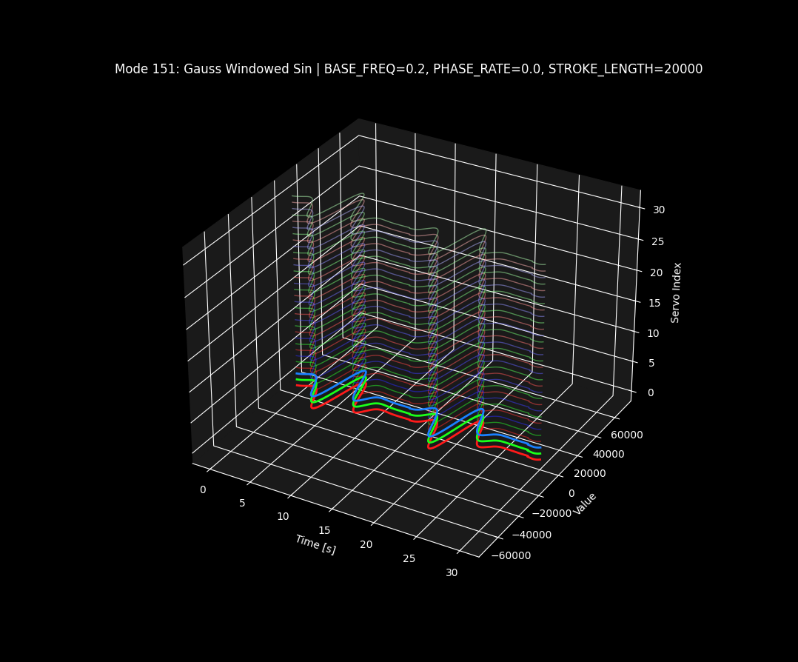

# Mode Relationships and Function Call Dependencies

This document provides a detailed representation of the modes defined in `params.json` and their relationships with the functions in `osc_modes.py`. Each mode is connected to the functions it directly references (`FUNC` and `AMP_MODE`), and the functions are further connected to their internal dependencies, including the parameters they use.

[<= back to README(HOME)](README.md)

---

## Mode Specific Params

| Parameter                   | Description                                        |
| --------------------------- | -------------------------------------------------- |
| `BASE_FREQ`                 | Base frequency for oscillations.                   |
| `STROKE_LENGTH`             | Length of the stroke for oscillatory motion.       |
| `PHASE_RATE`                | 鉛直方向に位相をオフセットしていく度合い           |
| `PARAM_A`  ,`PARAM_B`       | Custom parameters for mode-specific calculations.  |
| `AMP_MODE`                  | Amplitude mode (e.g., `solid`, `cone`, `amp_sin`). |
| `AMP_FREQ`                  | Frequency of amplitude modulation.                 |
| `AMP_PARAM_A`,`AMP_PARAM_B` | Custom parameter for amplitude modulation.         |

---

## Mode Description

### `101` Simple Sin ★★☆

単純Sin波
`vals[i] ∝ STROKE_LENGTH * sin(t + PHASE_RATE * i * t)`

- `PHASE_RATE`
  - 鉛直方向に`PHASE_RATE`個の節をいれる

### `102` Azimuth Slide ★★☆

Azimuth(=水平方位角)ごとに位相を揃えたSin波
`vals[i] ∝ STROKE_LENGTH * sin(t + azimuth_phase(i) * t)`

- `PHASE_RATE`
  - 鉛直方向に`PHASE_RATE`個の節をいれる

### `111` Coned Sin ★★☆

鉛直方向にConic Curveのamplitudeをかけた`101`
`vals[i] ∝ <101> * sin(t + azimuth_phase(i) * t)`

- `PHASE_RATE`
  - 鉛直方向に`PHASE_RATE`個の節をいれる(`=>101`)

- `AMP_PARAM_A`
  - Conic Curveの曲率。`AMP_PARAM_A=0.5`で`101`と同じになる
  
### `112` Coned Azimuth Slide ★★☆

鉛直方向にConic Curveのamplitudeをかけた`102`
`vals[i] ∝ <102>> * sin(t + azimuth_phase(i) * t)`
[112_thumbnail](readme/112.png)

- `PHASE_RATE`
  - 鉛直方向に`PHASE_RATE`個の節をいれる(`=>102`)
  
- `AMP_PARAM_A`
  - Conic Curveの曲率。`AMP_PARAM_A=0.5`で`102`と同じになる

### `121` Sined Sin ★☆☆

Sinのamplitudeをかけた`101`
`vals[i] ∝ <101> * ((1-AMP_PARAM_A) + AMP_PARAM_A * sin( AMP_FREQ * t + AMP_PARAM_B * i * t)`

- `PHASE_RATE`
  - 鉛直方向に`PHASE_RATE`個の節をいれる(`=>101`)
  
- `AMP_PARAM_A`
  - amplitudeをかける度合い
- `AMP_PARAM_B`
  - amplitudeの`phase rate`
- `AMP_PARAM_A = AMP_PARAM_B = 0.0`で`101`と同じになる

### `122` Sined Azimuth slide ★☆☆

Sinのamplitudeをかけた`102`
`vals[i] ∝ <102> * ((1-AMP_PARAM_A) + AMP_PARAM_A * sin( AMP_FREQ * t + AMP_PARAM_B * i * t)`
[122_thumbnail](readme/122.png)

- `PHASE_RATE`
  - 鉛直方向に`PHASE_RATE`個の節をいれる(`=>102`)
  
- `AMP_PARAM_A`
  - amplitudeをかける度合い
- `AMP_PARAM_B`
  - amplitudeの`phase rate`
- `AMP_PARAM_A = AMP_PARAM_B = 0.0`で`102`と同じになる

### `151` Gauss Windowed Sin ★★☆

時間方向にガウス窓のかかった`101`
`vals[i] ∝ <101> * amp_gaussian_window(t, AMP_FREQ, AMP_PARAM_A)`

- `PHASE_RATE`
  - 鉛直方向に`PHASE_RATE`個の節をいれる(`=>101`)
  
- `AMP_FREQ`
  - ガウス窓が来る周期
- `AMP_PARAM_A`
  - ガウス窓が開いている比率
  
### `151` Gauss Windowed Azimuth Slide ★★☆

時間方向にガウス窓のかかった`102`
`vals[i] ∝ <102> * amp_gaussian_window(t, AMP_FREQ, AMP_PARAM_A)`
[152_thumbnail](readme/152.png)

- `PHASE_RATE`
  - 鉛直方向に`PHASE_RATE`個の節をいれる(`=>102`)

- `AMP_FREQ`
  - ガウス窓が来る周期
- `AMP_PARAM_A`
  - ガウス窓が開いている比率

### `301` Soliton wave ★★★

孤立波が流れる

- `PARAM_A`
  - solitonの時間的長さ(周期に対する比率)
- `PARAM_B`
  - solitonが鉛直方向に流れる速さ

### `4xx` damping oscilation

**減衰系のモードはワンショットモーション**です
`t = 0`直後に最も動きが大きく、減衰後はほぼ動かないままになります

- `AMP_FREQ`
  - 減衰振動の周波数
- `AMP_PARAM_A`
  - 減衰係数
- `AMP_PARAM_B`
  - 鉛直方向伝搬速度

### `501` [DEPLICATED] emerging sin

***振幅モードemergingは非推奨***です
徐々に振幅が大きくなる`101`
`STROKE_LENGTH`のロックを解除し、`101`の`STROKE_LENGTH`を変化させるのが推奨

- `AMP_PARAM_A`
  - solitonの時間的長さ(周期に対する比率)

### `502` [DEPLICATED] emerging Azimuth Slide

***振幅モードemergingは非推奨***です
徐々に振幅が大きくなる`102`
`STROKE_LENGTH`のロックを解除し、`102`の`STROKE_LENGTH`を変化させるのが推奨
[502_thumbnail](readme/502.png)

- `AMP_PARAM_A`
  - solitonの時間的長さ(周期に対する比率)

### `601` locational amped sin

ある"地点"から遠いほど振幅が小さくなる`101`です

- `AMP_PARAM_A`
  - 振幅への影響度
- `LOCATION_DEGREE`
  - "地点"の位置の極座標θ
- `LOCATION_DEGREE`
  - "地点"の位置の極座標z

### `602`locational amped Azimuth Slide

ある"地点"から遠いほど振幅が小さくなる`102`です
[602_thumbnail](readme/602.png)

- `AMP_PARAM_A`
  - 振幅への影響度
- `LOCATION_DEGREE`
  - "地点"の位置の極座標θ
- `LOCATION_DEGREE`
  - "地点"の位置の極座標z

### `700` [DEPLICATED] random

全ての軸が周期ごとにランダム値までステップ動作します
[700_thumbnail](readme/700.png)

### `701` random sin

全ての軸が異なる位相でsin波動作します
[701_thumbnail](readme/701.png)

### `702` random sin freq

全ての軸が異なる位相と周期でsin波動作します
[702_thumbnail](readme/702.png)

## Mode Relationships

