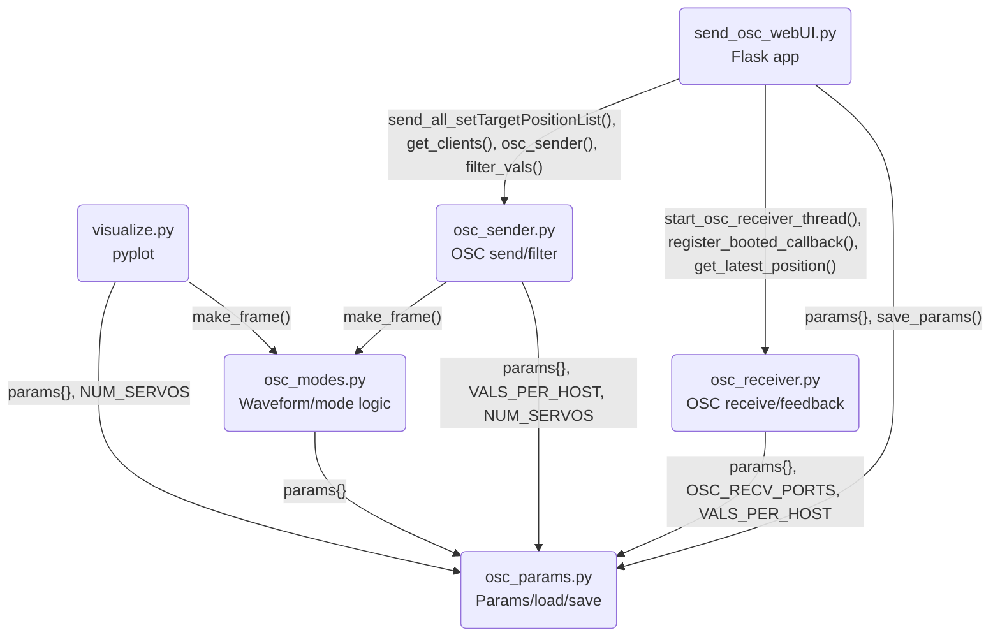

# kfy25

Welcome to the `kfy25` project!

## Overview

kfy25 is a web-based OSC servo controller built with Flask and python-osc.  
It provides a browser UI to control multiple servos, tune parameters in real time, and receive feedback from devices.

## What's new / Changelog (recent)

- Refactored osc_modes: common waveform/core logic extracted; window functions (gaussian/rectangular) separated and reusable.
- Added "soliton" (isolated wave) mode and AMP_MODE support (solid/cone).
- Homing: server now waits for device homingStatus == 3 (completion) before re-enabling servo mode.
- get_target_position: clears previous cached value and waits for fresh OSC /position response (configurable timeout).
- osc_receiver: collects /position and /homingStatus per motor with timestamps.
- UI improvements: updated Font Awesome 6 class names, formatted target position with thousands separators.
- Server: run without Flask reloader (avoids duplicate threads); timeouts configurable via params.json.

## Features

- WebUI for real-time control and parameter adjustment (BASE_FREQ, PHASE_RATE, STROKE_LENGTH, STROKE_OFFSET, LPF ALPHA, PID gains, etc.)
- Multi-host support: distribute servo commands to multiple HUBs
- Start/Stop OSC sending with smoothing/filtering
- Homing, Init, Release, Step, ResetPos, SetTargetPosition, GetTargetPosition
- OSC receive support: listens on multiple ports (default 50100–50103) and maps feedback to motorID
- Persistent parameter storage in `params.json`
- Modular code: `osc_params.py`, `osc_modes.py`, `osc_sender.py`, `osc_receiver.py`, `send_osc_webUI.py`

## Requirements

- Python 3.8+
- pip packages:
  - flask
  - python-osc
  - numpy

Install:

``` bash
pip install flask python-osc numpy
```

## Run

Start server:

``` bash
python send_osc_webUI.py
```

By default the app runs with the Flask reloader disabled to avoid double-starting background OSC threads.

Open:

``` bash
http://localhost:5000/
```

## Important behaviors / notes

- motorID indexing: the WebUI and API use 1-based motorID.
- Homing: when issuing a homing command to a motor, the server waits for the device to send `/homingStatus (local_id, status)` and treats `status == 3` as completion. The device is re-enabled after completion (or timeout).
- Get position: when calling `/get_target_position`, the server clears any cached value for that motor, sends `/getPosition` to the device, and waits (configurable) for a fresh `/position` OSC message before returning.
- OSC receive mapping: received `/position (local_id, position)` is converted to a global motorID using the receiving port index and VALS_PER_HOST (see `osc_params.py`).
- Timeouts and other behavior are configurable in `params.json` (e.g., `GETPOS_TIMEOUT`, `HOMING_TIMEOUT`).

## File Structure

``` misc
osc_webUI/
├── osc_modes.py         # Mode-specific waveform/animation logic
├── osc_params.py        # Parameter definitions, load/save logic
├── osc_sender.py        # OSC communication and filtering logic
├── osc_receiver.py      # OSC receive logic and feedback handling
├── send_osc_webUI.py    # Flask app entry point and routing
├── static/
│   ├── main.js          # Frontend JS logic
│   └── style.css        # UI styling
├── templates/
│   └── index.html       # WebUI template
├── params.json          # Persistent parameter storage (auto-generated)
└── spiral-torso_OSC_002_STEP800.gh # Example Grasshopper file
```

## Notes

- [Ponoor Step Series Documentation](https://ponoor.com/docs/step-series/)
- All parameter changes are saved to `params.json` automatically.
- The UI is designed for use with modern browsers.
- **OSC receive**: The system listens on multiple ports (default: 50100–50103) and maps feedback to the correct motorID, supporting multi-device feedback and synchronization.
- **motorID**: The system uses 1-based indexing for motorID in the UI and API.

## System Structure

```mermaid
graph LR
    subgraph Web Browser UI
        Browser@{ img: "https://github.com/rio-fujimiya/Resource-Delivery/blob/main/kfy25/webUI.png?raw=true", h: 720, constraint: "on" }
    end

    subgraph Server
        subgraph Flask[ ]
            flask-m(Flask server)
            flask-m -.- modes-m(modes)
            flask-m -.- params-m(params)
            flask-m -.- osc-m(osc sender/receiver)
        end

        Params("params.json")
    end

    subgraph gh[Grasshopper preview]
        GH-img@{ img: "https://github.com/rio-fujimiya/Resource-Delivery/blob/main/kfy25/gh.png?raw=true", h: 100, constraint: "on" }
    end
    osc-m -- OSC UDP<br/>[127.0.0.1:5000]<br/>/setTargetPositionList ---> gh

    subgraph Motion Visualizer
        pyplot@{ img: "https://github.com/rio-fujimiya/Resource-Delivery/blob/main/kfy25/visualizer.png?raw=true", h: 200, constraint: "on" }
    end
    modes-m --> pyplot
    params-m --> pyplot

    subgraph Ethernet
        Hub[switching hub]
        Hub --- S8-1[STEP800 ID:0<br/>motorID:1~8]
        Hub --- S8-2[STEP800 ID:1<br/>motorID:9~16]
        Hub --- S8-3[STEP800 ID:2<br/>motorID:17~24]
        Hub --- S8-4[STEP800 ID:3<br/>motorID:25~32]
    end

    Browser -- HTTP/HTML/JS/CSS <--> flask-m
    params-m -- write/read <--> Params
    osc-m -- OSC UDP<br/>[10.0.0.100~103:50000]<br/>/setTargetPositionList, /setServoParam, /getPosition, etc. ---> Hub
    Hub -- OSC UDP<br/>[10.0.0.10:50100~50103]<br/>/position, /booted --> osc-m    
```

## Python Module Dependency



**Dependency summary:**

- `send_osc_webUI.py` is the Flask entry point and imports all logic modules.
- `osc_sender.py` handles OSC communication and filtering, and depends on `osc_params.py` for parameters and `osc_modes.py` for waveform generation.
- `osc_receiver.py` handles OSC feedback and device state, and depends on `osc_params.py` for configuration.
- `osc_modes.py` provides waveform/mode logic and may reference parameters from `osc_params.py`.
- `osc_params.py` manages parameter definitions and persistent storage, and is the base for all.

## Feedback and Support

- For device setup, refer to [Ponoor Step Series Tutorial](https://ponoor.com/docs/step-series/tutorial/)
- For network and DIP switch settings, see [Ponoor Step Series Network Settings](https://ponoor.com/docs/step-series/settings/network-and-dip-switch/)
- For issues or feature requests, please open an issue on your repository or contact the maintainer.
